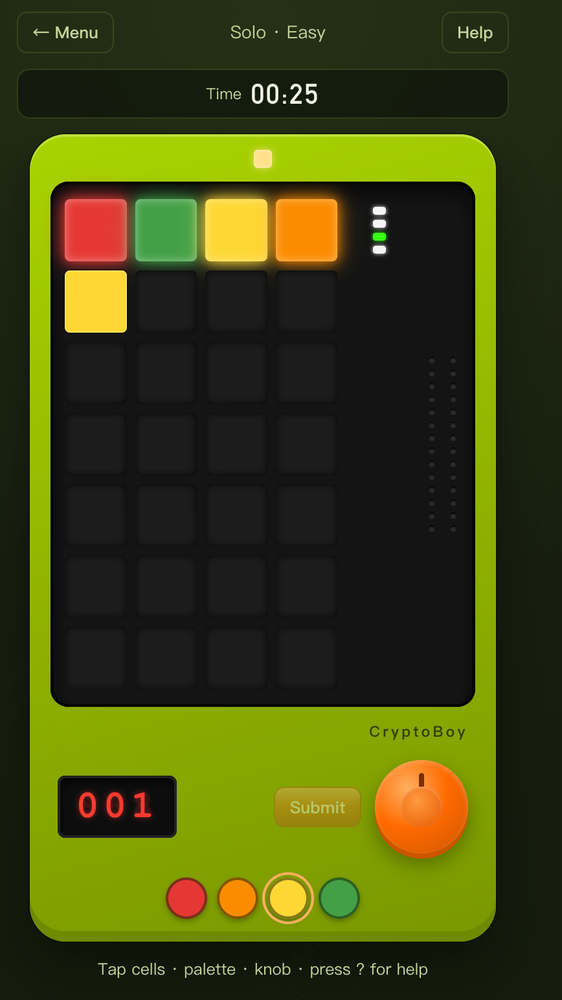

# CryptoBoy

[](https://react.dev/)

破译四色密码 · 最多七次机会。  
仿照复古「颜色密码破译」小玩具做的 **浏览器数字版**，纯属娱乐、非商业用途；无账号、纯前端单机，界面支持 **简体中文 / English**。

**在线试玩 → [mulander-j.github.io/cryptoboy](https://mulander-j.github.io/cryptoboy/)**

<!-- markdownlint-disable-next-line MD033 -->


## 特性

- **闯关 Solo**：简单 / 进阶 / 噩梦（限时）+ **无尽**连破；各关最佳用时与连胜本地保存；URL 可直达关卡
- **厄运时刻（Fate Night）**：噩梦 / 无尽默认开启；三锁一悬时以左轮玩法敲定末色（试炼可选手动开关）
- **自由练习**：难度预设、颜色数、重复、提示、限时、预设答案（本地双人）、厄运时刻等可配
- **数据页**：各模式进度与各关最佳；页内可重置闯关 / 无尽进度（设置保留）
- **复古机身**：LED 灯阵、数码管、旋钮与色盘；多套主题；像素品牌字体自托管
- **设置**：语言 / 主题 / 音效 / 色盲图案 / 前置确认
- **玩法说明**：首次引导 + 对局顶栏 Help / 快捷键 `?` `H`

## 本地开发

```bash
npm install
npm run dev          # http://127.0.0.1:5173
npm test
npm run build
npm run preview      # http://127.0.0.1:4173
```

本地服务仅绑定 `127.0.0.1`。  
`main` 合并后由 GitHub Actions 自动部署到 Pages（见 `.github/workflows/deploy-pages.yml`）。  
项目站 `base` 为 `/cryptoboy/`；构建会生成 `404.html` 作 SPA 深链回退。

## 怎么玩

1. 打开主菜单，选 **单人**（含无尽）或 **自定义试炼**
2. **设置和其他** 可改语言、主题、音效等；**数据** 看进度与最佳，并可重置；对局顶栏 **Help** 或按 **?** / **H** 看教程
3. 点灯格循环换色，或用底部色盘 / 旋钮（拖转换色、短按移格、**长按提交**；桌面也可 **Enter**）
4. 填满 4 格后提交；根据提示推理，最多 **7** 次机会；噩梦 / 无尽注意倒计时与厄运时刻

## 目录

| 路径 | 说明 |
| ------ | ------ |
| [`src/domain`](./src/domain/README.md) | 规则内核（评估 / 生成 / 会话 / `fateCase` 厄运时刻，可单测） |
| [`src/data`](./src/data/README.md) | 关卡曲线、自定义练习、localStorage 进度 |
| [`src/i18n`](./src/i18n/README.md) | 简中 / 英文文案（`locales/*.json`） |
| [`src/app`](./src/app) | 路由、`ProgressProvider`、Layout（`paths.ts`） |
| [`src/features`](./src/features/README.md) | 菜单、闯关、数据页、帮助等（含 `pages/`） |
| [`src/ui`](./src/ui/README.md) | 机身组件、[主题](./src/ui/theme/README.md)、图标 |
| [`src/lib`](./src/lib/README.md) | 框架/部署向薄工具（如 `assetUrl`） |
| `docs/` | 产品规格、计划、联机草案、截图 |

## 文档

- [产品规格 PRODUCT.md](./docs/PRODUCT.md)
- [任务计划 PLAN.md](./docs/PLAN.md)
- [代码规范 CODE_STANDARDS.md](./docs/CODE_STANDARDS.md)
- [联机草案 DUO.md](./docs/DUO.md)（延后；暂无独立菜单）

## 联系我们

欢迎通过 [GitHub Issues](https://github.com/Mulander-J/cryptoboy/issues) 反馈问题、提建议或交流玩法——新 Issue 随时欢迎。

## License

[MIT](./LICENSE) © 2026 Mulander-J
