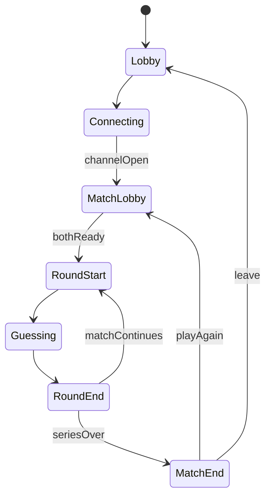

# Duo · 联机双人草案（WebRTC）

> 状态：**设计草案**（未实现）  
> 关联：[PRODUCT.md](./PRODUCT.md) §4.2 · [PLAN.md](./PLAN.md) · 本地双人 = 自由练习「预设答案」  
> 产品定调：**单局约 30s，联机价值在「连上后连打多盘」**；用系列局、积分、道具赛拉长对局、提高竞技性。

---

## 0. 产品定调（先读）

### 为何不能「连上只打一局」

- Solo / 练习一局常常 **半分钟级**；建连、对房间码、等齐的成本可能接近甚至超过一局。  
- 因此联机 Duo 的结算单位应是 **一盘 Match（多局 Round）**，不是单局 Round。  
- 道具赛、积分、换边、团队配合等，核心目的都是：**摊薄连线成本、拉长有效对局时长、做出竞技感**。

### 模式优先级

| 优先级 | 模式 | 一句话 |
|--------|------|--------|
| P0 主推 | **同密竞速系列** | 同一 secret，两人各自猜，先破或更优者得分；连打多局 |
| P1 | **轮换出题系列** | 一局 Host 出 / Guest 猜，局末换边；比系列总分 |
| P2 | **道具赛 / 特殊规则** | 在系列局上叠道具（如亮 3 绿后可改一槽），拉长决策 |
| P3 | **协作** | 两人共用信息或分工（见 §2.3），偏派对而非 1v1 |

本地「预设答案」仍覆盖 **一台设备换手**；联机主战场是 **多设备 + 一盘多局**。

### 与传输的关系

- 传输仍建议 **WebRTC DataChannel + 极薄信令**（无自建游戏服）。  
- **权威模型随模式变**：  
  - 竞速：可用 **裁判 Host**（只生成/持密、广播反馈，自己也猜）或双方各自算但需信任/commit。MVP 倾向 **中立 Host 持密 + 双方都是破译方 UI**。  
  - 出题局：经典 **出题方 Host 持密**。

---

## 1. 范围

### 1.1 草案目标

- 两名玩家、两台设备。  
- **一盘 Match**：默认 **三局两胜** 或 **先到 N 分**（可配置 3/5 局）。  
- 单局规则仍基于现有 Mastermind：`colorCount` / `allowRepeat` / `hintStyle` / 最多 7 次。  
- 连接一次，局间 **不断开** DataChannel，只重置 Round 状态。

### 1.2 明确不做（本阶段）

- 账号、全球排行榜、大厅匹配（可用房间码熟人局）。  
- 密码长度 6（见 PLAN）。  
- 把 Duo 当 TOTP。  
- 每步上链；NFT 仅远期纪念层。

### 1.3 与本地双人

| | 本地（已做） | 联机（本草案） |
|--|-------------|----------------|
| 入口 | 练习「预设答案」 | `/duo` 开房 / 加入 |
| 时长 | 单局 + 可重试同密 | **一盘多局** 为主 |
| 社交 | 同机换手 | 分设备；连上后连打 |
| 内核 | `evaluate` 等 | 同左 |

---

## 2. 玩法设计

### 2.1 同密竞速（主模式）

```
Match 开始 → 同步规则与「准备」
  → Round i: 生成同一 secret（Host 权威）
  → 双方同时 Guessing（互不可见对方灯阵细节，或只见「对方已猜 n 次」）
  → 先完全破译者得局分；或双方都破后比次数/用时
  → 未在 7 次内破译 → 本局不得分 / 双负
  → 直到 Match 结束 → 总积分 / 胜者 → 可再来一盘（同连接）
```

**计分（草案默认）**

- 先破译：+2  
- 后破译但次数更少：+1（可选，防纯手速）  
- 仅一方破译：破译者 +2  
- 局末可加「用时奖」小数分（第二期）

**信息隔离**：对方的具体猜测默认不直播（避免抄）；可开「观战彩蛋」显示对方已用次数。

### 2.2 轮换出题（副模式）

- 奇偶局交换出题方；出题方持密，破译方猜。  
- 破译成功 → 破译方得分；7 次失败 → 出题方得分。  
- 一盘多局累计；适合「你出我猜」社交，竞技性略弱于竞速。

### 2.3 道具赛（拉长对局 / 增竞技）

在系列局规则上叠加，**不改 4 槽本体**。示例（皆可配置开关）：

| 道具 | 触发 | 效果 |
|------|------|------|
| 改色锤 | 本局已有 ≥3 绿（或消耗次数） | 可改自己猜测中 1 槽再提交 |
| 透视 | 每盘 1 次 | 揭示某一列是否 exact（消耗一次行动） |
| 干扰 | 竞速 | 给对方下一提交延迟 / 打乱色盘顺序数秒 |
| 冻结 | 竞速 | 短时禁止对方提交 |

原则：道具 **增加决策回合与节奏变化**，避免变成纯手速点格；数值后期再调。

### 2.4 协作（可选支线）

- 两人面对同一 secret，共享 feedback 池或分列负责，比「合作最少总次数」。  
- 服务「派对 / 亲子」，与 1v1 积分分轨。

### 2.5 时长预期（设计锚点）

| 单位 | 目标时长 |
|------|----------|
| 单局 Round | ~20–45s（与现在手感接近） |
| 一盘 Match（3 局） | **~2–4 min**（值得连一次线） |
| 道具赛 / 五局 | **~5–8 min** |
| 连打多盘 | 连接保持，局间 &lt;5s 进入下一 Round |

---

## 3. 会话结构：Match ⊃ Round



| 层级 | 状态内容 |
|------|----------|
| Connection | WebRTC、心跳、房间码 |
| Match | 模式、局数、比分、道具库存 |
| Round | secret、双方 attempts、倒计时（可选） |

**关键：断线重连恢复的是 Match 快照（比分 + 当前 Round），不是让用户重连只为打完半局就散。**

---

## 4. 角色与权威（按模式）

### 4.1 竞速模式

```
Host（裁判 + 也可作为玩家 A）
├─ 生成 secret，对 A/B 的 GUESS 分别 evaluate
├─ 下发各自 FEEDBACK；广播比分 / ROUND_END
└─ Guest 为玩家 B
```

- Guest **永不收明文 secret**（结算揭秘可配置）。  
- Host 若同时竞速：UI 分「自己的灯阵」；逻辑上 Host 客户端也只显示自己的 feedback（secret 在内存但不渲染给自己「开挂面板」——荣誉约定；硬核可把生成放到双方 commit 后揭示，第二期）。

### 4.2 出题模式

经典出题方持密；与旧草案一致。玩具级信任：出题方可谎报 feedback。

---

## 5. 信令与建连

与前版相同，要点：

1. Host 开房 → 短房间码。  
2. 极薄信令换 SDP/ICE（Worker 或二维码）；**建连后对局不经业务服**。  
3. 公共 STUN；TURN 为可选增强。  
4. HTTPS；房间码短 TTL。  

因一盘要打多局，**更应优先做稳的房间码信令（体验）**，二维码仅作零后端验证协议。

---

## 6. DataChannel 协议（v1 草案）

帧：`{ v: 1, type, payload }`，可靠有序。

### 6.1 连接与 Match

| type | 方向 | 说明 |
|------|------|------|
| `HELLO` | H→G | `protocolVersion, matchConfig`（模式、局数、规则、道具开关） |
| `RULES_ACK` | G→H | 接受 / 拒绝 |
| `MATCH_START` | H→G | `{ matchId, scores: {a:0,b:0} }` |
| `READY` | 双向 | 下一 Round 双方准备 |
| `PING` / `PONG` | 双向 | 心跳 |
| `BYE` | 双向 | 离开（结束整个 Connection） |

### 6.2 Round（竞速）

| type | 方向 | 说明 |
|------|------|------|
| `ROUND_START` | H→G | `{ roundIndex, rules }` **无 secret** |
| `GUESS` | 玩家→Host | `{ player, id, slots[4] }` |
| `FEEDBACK` | H→玩家 | `{ player, id, exact, present, perSlot?, status }` 只给对应玩家 |
| `OPPONENT_META` | H→双方 | `{ player, attemptsUsed }` 可选，不露内容 |
| `ROUND_END` | H→双方 | `{ scores, winner?, secret?, reason }` |
| `MATCH_END` | H→双方 | `{ finalScores, matchWinner }` |
| `SNAPSHOT` | H→G | 重连：Match + 当前 Round 己方 attempts |

出题模式下保留 `SECRET_READY`（无密文），Guest 单人 `GUESS`。

### 6.3 道具（P2）

| type | 说明 |
|------|------|
| `ITEM_USE` | `{ player, itemId, target? }` |
| `ITEM_EFFECT` | Host 裁定后广播 / 单播结果 |

---

## 7. 路由与模块（落地时）

| 路径 | 说明 |
|------|------|
| `/duo` | 大厅：模式（竞速/出题）、局数、开房/加入 |
| `/duo/match` | 一盘进行中（按角色渲染） |

```
src/features/duo/
  pages/
  DuoMatch.ts       # Match/Round 状态机（可测）
  scoring.ts        # 积分规则
  protocol.ts
  items/            # P2
  transport/webrtc.ts | memory.ts
```

---

## 8. UX 要点

1. 大厅强调：**「一盘多局 · 连上接着打」**，默认三局两胜。  
2. 局间结果条：**比分 1–0 → 下一局倒计时 3…2…1**，勿回到大厅。  
3. Match 结束大结算：总场次、平均用时、再来一盘（同连接）。  
4. 断线黄条；重连后比分仍在。  
5. 道具赛入口用副标签，避免新手第一眼复杂。

---

## 9. 断线与生命周期

- 心跳超时 → 暂停当前 Round（可选）或标记断线方负局。  
- 恢复 → `SNAPSHOT`（比分 + 己方 attempts）。  
- 刷新 → Match 丢失回 `/duo`（secret 不落盘）。  
- **BYE** = 整盘弃权，不是跳过一局。

---

## 10. 实现切片

| 切片 | 内容 | 验收 |
|------|------|------|
| D0 | Match/Round 状态机 + memory transport + 计分单测 | 无 UI 连打 3 局 |
| D1 | `/duo` 大厅 + 同页双客户端调试竞速 | 一盘三局可打完 |
| D2 | WebRTC + 房间码信令 | 两真机连打完整 Match |
| D3 | 局间流畅 UX、心跳、SNAPSHOT | 断线可恢复比分 |
| D4 | 轮换出题模式 | 与竞速共用 Match 壳 |
| D5 | 道具赛最小集（1～2 个道具） | 时长与节奏可感知变长 |
| D6 | i18n / 帮助 / 文档勾选 | 齐 |

---

## 11. 开放问题

1. 竞速默认 **先破得分** 还是 **双方都破后比次数**？  
2. Host 是否允许同时参赛（荣誉制）还是纯裁判？  
3. 默认三局两胜还是五局？  
4. 对手「已猜次数」默认开还是关？  
5. 第一个道具选改色锤还是透视？

---

## 12. 一句话

> 联机 Duo 的意义不在「再猜一轮 30 秒」，而在 **连上之后用系列局、积分和道具把一盘打满几分钟**；同密竞速作主模式，出题换边与道具赛作加长与变奏，WebRTC 只负责稳住这场多人会话。
